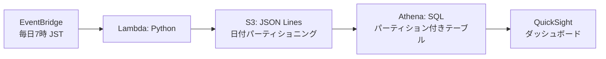

# portfolio-01-osaka-weather

大阪の天気データを用いたサーバーレスデータレイクパイプライン

## 概要

インフラエンジニアとしての知見を活かし、**IaC（Terraform）で全リソースを管理**したデータレイク基盤です。
Open-Meteo APIから大阪の天気予報を毎日自動取得し、S3に蓄積 → AthenaでSQL分析 → QuickSightで可視化する
一連のパイプラインを構築しました。

## アーキテクチャ



## 使用サービスと選定理由

| サービス               | 役割                         | 選定理由                                                         |
| ---------------------- | ---------------------------- | ---------------------------------------------------------------- |
| **Amazon S3**          | データレイク（生データ保存） | サーバーレスでスケーラブル。日付パーティショニングで管理しやすい |
| **AWS Lambda**         | データ収集・加工             | イベント駆動で実行。API呼び出しとJSONフラット化を1つの関数で処理 |
| **Amazon EventBridge** | スケジュール実行             | cron式で簡単に定期実行設定。運用管理が不要                       |
| **Amazon Athena**      | SQL分析エンジン              | S3上のデータを直接クエリ。パーティション指定で高速化             |
| **Amazon QuickSight**  | 可視化・ダッシュボード       | マネージドBI。Athenaと直接連携でき、共有も簡単                   |
| **Terraform**          | IaC（インフラコード化）      | インフラエンジニアとしての強み。再現性とバージョン管理を実現     |

## データフロー

```
[Open-Meteo API]
    ↓
[Lambda: urllibで取得 → JSONフラット化 → JSON Lines形式]
    ↓
[S3: s3://bucket/YYYY/MM/DD/osaka_weather.jsonl]
    ↓
[Athena: パーティション付き外部テーブル]
    ↓
[QuickSight: 気温推移（折れ線）+ 降水量（棒グラフ）]
```

## データソース

- **Open-Meteo API**（無料、APIキー不要）
- **対象地域**：大阪（緯度34.6937、経度135.5023）
- **取得項目**：最高気温、最低気温、降水量、天気コード
- **予報期間**：取得日から7日間

## 困難だった点と解決策

### 1. JSONのネスト構造をAthenaで扱えなかった

- **問題**：Open-Meteo APIのレスポンスは `daily` 配列内に複数の配列がネスト
- **解決**：Lambdaでフラット化し、**1行1日分のJSON Lines形式**に変換
- **学び**：データレイクでは「取り込み時の前処理」が重要。生データのまま保存すると分析が困難

### 2. Glue Crawlerの自動判定に翻弄された

- **問題**：Table Level設定で意図しないテーブル名や重複データが生成
- **解決**：Crawlerを諦め、**手動でパーティション付きテーブルを作成**
- **学び**：自動化は便利だが、スキーマ設計の意図を明確にするため、DDLを直接管理する価値がある

### 3. QuickSightアカウント作成で制限に遭遇

- **問題**：Free TierアカウントでQuickSightのサブスクリプションが作成できない
- **解決**：有料プランに変更後、東京リージョンで登録完了
- **学び**：AWSサービスの利用条件を事前に確認。コスト管理（Budgets設定）とセットで考える

## コスト最適化

| 対策                       | 内容                              |
| -------------------------- | --------------------------------- |
| **S3ライフサイクルルール** | Athenaクエリ結果を1日後に自動削除 |
| **S3バージョニング**       | 誤削除・上書きからの復旧が可能    |
| **Lambdaタイムアウト**     | 30秒に設定。無限ループ防止        |
| **Budgetsアラート**        | 月$10で80%/100%閾値通知           |

## インフラ構築手順

### 前提条件

- AWS CLI認証済み
- Terraformインストール済み

### 1. Terraformで基盤構築

```bash
terraform init
terraform plan
terraform apply
```

### 2. LambdaコードをS3にアップロード

```bash
# lambda_function.zip を作成
python -c "import zipfile; zipfile.ZipFile('lambda_function.zip', 'w').write('lambda_function.py')"

# S3にアップロード
# → S3://portfolio-01-osaka-weather-raw-2026-tetsu/lambda/lambda_function.zip
```

### 3. Athenaでテーブル作成

```bash
# Athenaクエリエディタで実行
athena_setup.sql
```

### 4. QuickSightでダッシュボード作成

- **データソース**：Athena（`osaka-weather-db.weather_data`）
- **グラフ1**：気温推移（最高気温・最低気温の折れ線グラフ）
- **グラフ2**：降水量（日別棒グラフ）

## ファイル構成

```
portfolio-01-osaka-weather/
├── main.tf                    # Terraform設定（S3 + Lambda + EventBridge）
├── lambda_function.py         # Lambda関数コード（API取得 → JSON Lines変換 → S3保存）
├── lambda_function.zip        # Lambdaデプロイパッケージ
├── athena_setup.sql           # Athenaテーブル作成 + パーティション追加SQL
├── test_osaka_weather.py      # ローカルテスト用（Open-Meteo API動作確認）
├── .gitignore                 # Terraform状態ファイル等の除外設定
└── README.md                  # 本ファイル
```

## 今後の改善案

| 改善項目           | 内容                                                       |
| ------------------ | ---------------------------------------------------------- |
| **Glue ETL Job化** | Lambdaのフラット化処理をGlueに移行し、大規模データに対応   |
| **Parquet化**      | JSON LinesからParquetに変換し、Athenaのクエリコストを削減  |
| **異常検知**       | 前日との気温差が10度以上の場合にアラート通知               |
| **予報精度検証**   | 実測値（Open-Meteo Archive API）と比較し、予報精度を可視化 |

## 学んだこと

- **S3の日付パーティショニング**によるデータ管理とライフサイクル設計
- **LambdaでのJSONフラット化**（ネストJSON → JSON Lines変換）
- **Athenaのパーティション付きテーブル**設計とMSCK REPAIR TABLEの運用
- **QuickSight**でのダッシュボード作成と権限設定
- **Terraform**によるIaC管理と`terraform import`による既存リソースの取り込み
- **インフラ視点とデータエンジニア視点の両立**が強みになる

## 作者

- GitHub: [TetsuyaTashiro-ocha5959](https://github.com/TetsuyaTashiro-ocha5959)
- 背景: インフラエンジニア → データエンジニア転職活動中
- 保有資格: AWS CLF, SAA, AIF, MLA, DEA（進行中）
